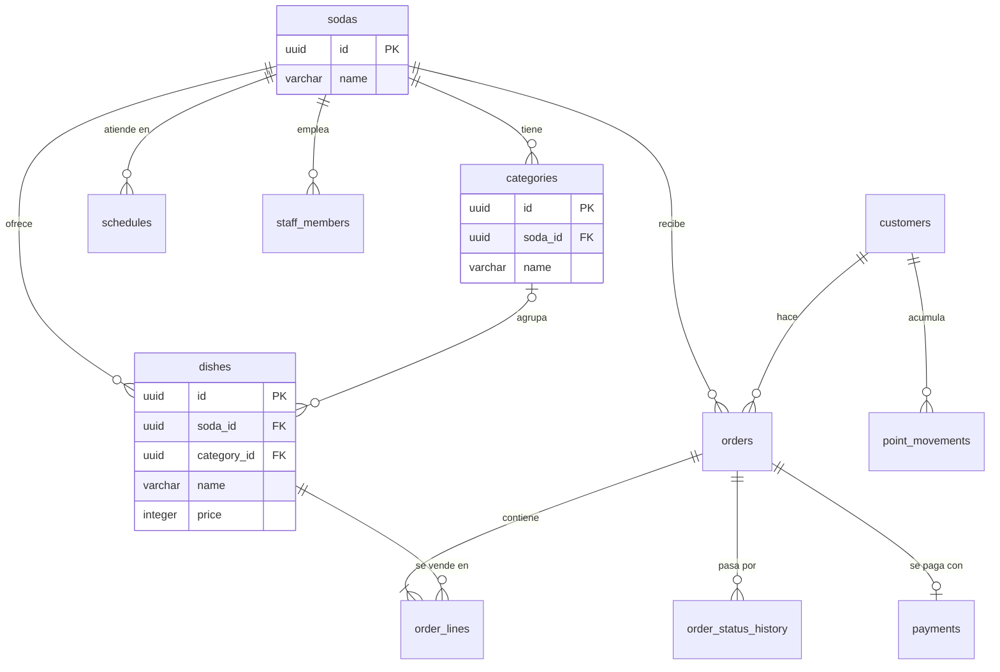

# Modelo de datos

El esquema está en tercera forma normal. Este documento describe las tablas que ya existen con todo su detalle y las entidades previstas a nivel de relación; cada módulo completa las suyas en el pull request que agrega su migración.

Las convenciones de nombres, llaves, fechas y dinero están en [database.md](database.md).

## Diagrama

Las tablas sin columnas en el diagrama están previstas y todavía no existen.

## Tablas del catálogo

### sodas

| Columna | Tipo | Regla |
| --- | --- | --- |
| `id` | `uuid` | Llave primaria, `DEFAULT uuidv7()` |
| `name` | `varchar(120)` | Obligatoria |
| `created_at`, `updated_at` | `timestamptz` | |

### categories

| Columna | Tipo | Regla |
| --- | --- | --- |
| `id` | `uuid` | Llave primaria, `DEFAULT uuidv7()` |
| `soda_id` | `uuid` | Llave foránea a `sodas`, borrado en cascada |
| `name` | `varchar(60)` | Única dentro de la soda |
| `created_at`, `updated_at` | `timestamptz` | |

Llaves candidatas: `id`, `(soda_id, name)` y `(id, soda_id)`. La última existe para que `dishes` pueda referenciar la categoría junto con su soda.

### dishes

| Columna | Tipo | Regla |
| --- | --- | --- |
| `id` | `uuid` | Llave primaria, `DEFAULT uuidv7()` |
| `soda_id` | `uuid` | Llave foránea a `sodas`, borrado en cascada |
| `category_id` | `uuid` | Opcional; llave foránea compuesta `(category_id, soda_id)` a `categories` |
| `name` | `varchar(120)` | Única dentro de la soda |
| `description` | `varchar(500)` | Opcional |
| `price` | `integer` | Colones enteros, `CHECK` entre 100 y 100 000 |
| `preparation_minutes` | `smallint` | `CHECK` entre 1 y 120 |
| `available_portions` | `smallint` | `CHECK` entre 0 y 500 |
| `is_active` | `boolean` | Por defecto `true` |
| `created_at`, `updated_at` | `timestamptz` | |

Al borrar una categoría, `category_id` de sus platos queda en nulo y el plato se conserva.

## Verificación de las formas normales

| Forma | Qué exige | Cómo se cumple |
| --- | --- | --- |
| Primera | Valores atómicos, sin grupos repetidos | Una fila por plato y una columna por dato; la categoría es una tabla, no una lista en el plato |
| Segunda | Ningún dato depende de una parte de la llave | Las llaves primarias son de una sola columna (`id`) |
| Tercera | Ningún dato depende de otro que no sea llave | El nombre de la categoría vive en `categories`, no en `dishes`; «agotado» no se guarda, se calcula de `available_portions` |

## Excepciones deliberadas

| Excepción | Por qué es correcta |
| --- | --- |
| `soda_id` se repite en `dishes` aunque la categoría ya lo implica | El plato pertenece a la soda aunque no tenga categoría. La llave foránea compuesta `(category_id, soda_id)` impide que los dos valores discrepen |
| La línea del pedido guardará el nombre y el precio del plato | No es un dato derivado: es el hecho histórico de a cuánto se vendió. Cambiar el precio del plato no debe alterar pedidos pasados |

## Regla para cada migración nueva

Antes de fusionar un pull request con una migración se revisa que la tabla tenga llave primaria `id`, que lleve `soda_id` si pertenece a una soda, que sus llaves únicas y foráneas incluyan `soda_id`, que no guarde valores calculables y que este documento quede actualizado.
