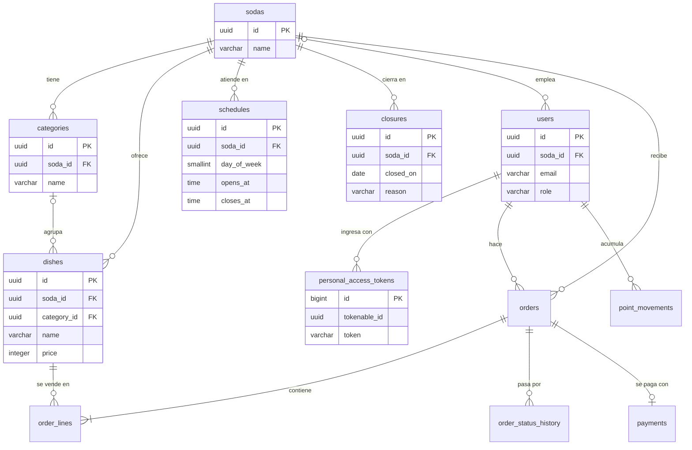

# Modelo de datos

El esquema está en tercera forma normal. Este documento describe las tablas que ya existen con todo su detalle y las entidades previstas a nivel de relación; cada módulo completa las suyas en el pull request que agrega su migración.

Las convenciones de nombres, llaves, fechas y dinero están en [database.md](database.md).

## Diagrama

Las tablas sin columnas en el diagrama están previstas y todavía no existen.

## Tablas del catálogo

### sodas

| Columna | Tipo | Regla |
| --- | --- | --- |
| `id` | `uuid` | Llave primaria, `DEFAULT uuidv7()` |
| `name` | `varchar(120)` | Obligatoria |
| `created_at`, `updated_at` | `timestamptz` | |

### categories

| Columna | Tipo | Regla |
| --- | --- | --- |
| `id` | `uuid` | Llave primaria, `DEFAULT uuidv7()` |
| `soda_id` | `uuid` | Llave foránea a `sodas`, borrado en cascada |
| `name` | `varchar(60)` | Única dentro de la soda |
| `created_at`, `updated_at` | `timestamptz` | |

Llaves candidatas: `id`, `(soda_id, name)` y `(id, soda_id)`. La última existe para que `dishes` pueda referenciar la categoría junto con su soda.

### dishes

| Columna | Tipo | Regla |
| --- | --- | --- |
| `id` | `uuid` | Llave primaria, `DEFAULT uuidv7()` |
| `soda_id` | `uuid` | Llave foránea a `sodas`, borrado en cascada |
| `category_id` | `uuid` | Opcional; llave foránea compuesta `(category_id, soda_id)` a `categories` |
| `name` | `varchar(120)` | Única dentro de la soda |
| `description` | `varchar(500)` | Opcional |
| `price` | `integer` | Colones enteros, `CHECK` entre 100 y 100 000 |
| `preparation_minutes` | `smallint` | `CHECK` entre 1 y 120 |
| `available_portions` | `smallint` | `CHECK` entre 0 y 500 |
| `is_active` | `boolean` | Por defecto `true` |
| `created_at`, `updated_at` | `timestamptz` | |

Al borrar una categoría, `category_id` de sus platos queda en nulo y el plato se conserva.

## Tablas de la soda

### schedules

Cada fila es una franja del horario de atención: un día de la semana y un intervalo de horas. Un día puede tener varias franjas.

| Columna | Tipo | Regla |
| --- | --- | --- |
| `id` | `uuid` | Llave primaria, `DEFAULT uuidv7()` |
| `soda_id` | `uuid` | Llave foránea a `sodas`, borrado en cascada |
| `day_of_week` | `smallint` | `CHECK` entre 1 (lunes) y 7 (domingo), según ISO 8601 |
| `opens_at` | `time` | Hora de apertura, incluida en la franja |
| `closes_at` | `time` | Hora de cierre, excluida de la franja; `CHECK (opens_at < closes_at)` |
| `created_at`, `updated_at` | `timestamptz` | |

La restricción de exclusión `schedules_no_overlap_excl` impide que dos franjas de la misma soda y del mismo día se traslapen. Dos franjas que se tocan (`08:00–12:00` y `12:00–15:00`) son válidas, porque el cierre no pertenece a la franja.

Las horas no llevan zona horaria: son horas de pared de la soda, que opera en `America/Costa_Rica`.

### closures

Días en que la soda no abre, aunque su horario diga lo contrario.

| Columna | Tipo | Regla |
| --- | --- | --- |
| `id` | `uuid` | Llave primaria, `DEFAULT uuidv7()` |
| `soda_id` | `uuid` | Llave foránea a `sodas`, borrado en cascada |
| `closed_on` | `date` | Fecha del cierre, en la zona horaria de Costa Rica; única dentro de la soda |
| `reason` | `varchar(200)` | Opcional |
| `created_at`, `updated_at` | `timestamptz` | |

Llaves candidatas: `id` y `(soda_id, closed_on)`. La segunda garantiza un solo cierre por soda y fecha. «Cerrar por el resto del día» no se guarda aparte: es un cierre con la fecha de hoy.

## Tablas de identidad

### users

Cada fila es una cuenta: un cliente o una persona del personal de una soda.

| Columna | Tipo | Regla |
| --- | --- | --- |
| `id` | `uuid` | Llave primaria, `DEFAULT uuidv7()` |
| `name` | `varchar(120)` | Obligatoria |
| `email` | `varchar(255)` | Única; se guarda recortada y en minúsculas |
| `password` | `varchar(255)` | Hash bcrypt de la contraseña, nunca la contraseña |
| `phone` | `text` | Opcional; se cifrará en la clase 13 |
| `role` | `varchar(20)` | `CHECK` entre `customer`, `kitchen` y `owner` |
| `soda_id` | `uuid` | Opcional; llave foránea a `sodas`, borrado en cascada |
| `is_active` | `boolean` | Por defecto `true`; una cuenta inactiva no puede ingresar |
| `terms_accepted_at` | `timestamptz` | Opcional |
| `whatsapp_consent_at` | `timestamptz` | Opcional |
| `created_at`, `updated_at` | `timestamptz` | |

Llaves candidatas: `id` y `email`. La restricción `users_soda_id_check` exige que el personal (`kitchen`, `owner`) tenga soda y que el cliente no la tenga.

El correo es único en todo el sistema y no dentro de cada soda: la persona ingresa con su correo antes de que se sepa a qué soda pertenece.

### personal_access_tokens

La crea Laravel Sanctum. Cada fila es un token de acceso emitido para un dispositivo.

| Columna | Tipo | Regla |
| --- | --- | --- |
| `id` | `bigint` | Llave primaria autoincremental |
| `tokenable_type`, `tokenable_id` | `varchar`, `uuid` | Dueño del token: la clase del modelo y su identificador |
| `name` | `text` | Nombre del dispositivo |
| `token` | `varchar(64)` | Único; hash SHA-256 del token, nunca el token |
| `abilities` | `text` | Lista de abilities en JSON |
| `last_used_at` | `timestamptz` | Opcional; último uso |
| `expires_at` | `timestamptz` | Opcional, con índice |
| `created_at`, `updated_at` | `timestamptz` | |

## Verificación de las formas normales

| Forma | Qué exige | Cómo se cumple |
| --- | --- | --- |
| Primera | Valores atómicos, sin grupos repetidos | Una fila por plato y una columna por dato; la categoría es una tabla, no una lista en el plato |
| Segunda | Ningún dato depende de una parte de la llave | Las llaves primarias son de una sola columna (`id`) |
| Tercera | Ningún dato depende de otro que no sea llave | El nombre de la categoría vive en `categories`, no en `dishes`; «agotado» no se guarda, se calcula de `available_portions` |

## Excepciones deliberadas

| Excepción | Por qué es correcta |
| --- | --- |
| `soda_id` se repite en `dishes` aunque la categoría ya lo implica | El plato pertenece a la soda aunque no tenga categoría. La llave foránea compuesta `(category_id, soda_id)` impide que los dos valores discrepen |
| La línea del pedido guardará el nombre y el precio del plato | No es un dato derivado: es el hecho histórico de a cuánto se vendió. Cambiar el precio del plato no debe alterar pedidos pasados |
| `personal_access_tokens.id` es `bigint` y no `uuid` | La tabla pertenece a Sanctum: el token que recibe el cliente tiene la forma `<id>\|<secreto>` y Sanctum busca la fila por ese número. No es un identificador del negocio |
| `personal_access_tokens` no tiene llave foránea a `users` | Sanctum define una relación polimórfica (`tokenable_type`, `tokenable_id`). Un token cuya cuenta ya no existe no autentica a nadie, porque Sanctum no encuentra a su dueño |

## Regla para cada migración nueva

Antes de fusionar un pull request con una migración se revisa que la tabla tenga llave primaria `id`, que lleve `soda_id` si pertenece a una soda, que sus llaves únicas y foráneas incluyan `soda_id`, que no guarde valores calculables y que este documento quede actualizado.
